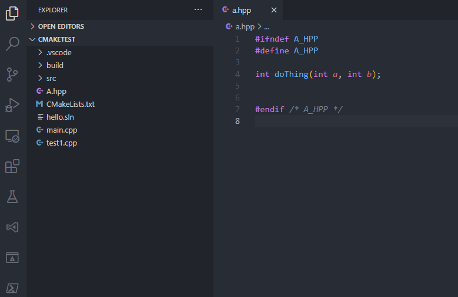

[](https://marketplace.visualstudio.com/items?itemName=akiramiyakoda.cppincludeguard)
[](https://marketplace.visualstudio.com/items?itemName=akiramiyakoda.cppincludeguard)
[](https://marketplace.visualstudio.com/items?itemName=akiramiyakoda.cppincludeguard)

# Insert C/C++ Include Guard Macros

The **C/C++ Include Guard** extension enables you to add, remove or update [include guard macros](https://en.wikibooks.org/wiki/More_C%2B%2B_Idioms/Include_Guard_Macro) to your C/C++ header files in one go.

Thanks to contributors: **@erkan-ozkan**, **@HO-COOH**, **@sleiner**

## Screenshots
Automatically insert include guard when creating a new header file


Insert and Remove include guard


Update existing include guard


Automatically update include guard when renaming a header file



## Features

* Generates include guard macros from GUID (or UUID v4), file name or file path. All non-alphanumeric characters are replaced with underscores.

```C
// GUID
#define E8A33412_A210_4F05_99A4_F6E2019B7137
// File name
#define UTILS_H
// File path form the prject root
#define FOO_BAR_UTILS_H
```

* Selectable comment style on ```#endif```. Block, line or none.

```C
/* Block comment. */
#endif /* AE2E827A_F4B3_422C_801F_DF9020986F2B */

// Line comment.
#endif // B93E7584_5E15_48C3_9D9C_92263000BF7B

// Without comment.
#endif
```

* Prevents GUIDs from starting with a decimal number. (Optional)

```C
// Can prevent ill-formed macros like this.
#define 47A7840C_D31B_4D39_BF77_E5E957F0A97A
```

* Adds a cusomizable prefix and/or suffix. (Optional)

```C
#define ABC_7FE87DA8_601D_4D8E_AEE5_E6BE6EAB5678_XYZ
```

* Shortens redundant underscores. (Optional)

```C
// From a path like 'foo/_bar_/utils.h'.
#define FOO_BAR_UTILS_H     // not FOO__BAR__UTILS_H
```

* Removes the file extension. (Optional)

```C
// From a path like 'foo/bar/utils.h'.
#define FOO_BAR_UTILS
```

* Selectable number of folders which should be used for include guard. (Optional)

```C
// From a path like 'foo/bar/utils.h'.
#define BAR_UTILS
```

* Skips comment blocks at the beginning of a file. (Optional)
* Inserts a blank line after the first comment blocks. (Optional)

```C
/**
 * Copyright (c) 2019 Akira Miyakoda
 *
 * This software is released under the MIT License.
 * https://opensource.org/licenses/MIT
 */

#ifndef FOO_BAR_UTILS_H     // <- Inserted here.
#define FOO_BAR_UTILS_H
```

* Removes #pragma once when an include guard is added. (Optional)

* Customizable number of spaces between ```#endif``` and its comment.
